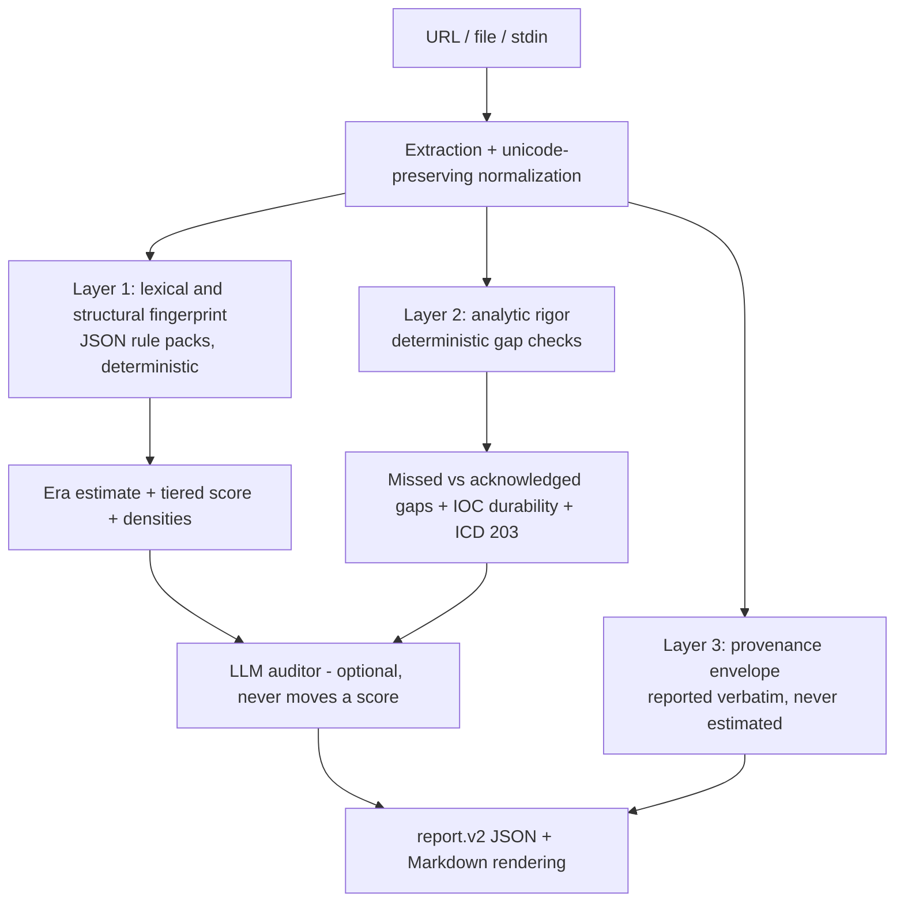

# stopslop

Analytic-rigor scorer for threat intelligence writing.

It answers two questions:

1. Does this text carry the statistical fingerprint of LLM generation, and which model era does that fingerprint match?
2. Does the analysis hold up: what's claimed, what's evidenced, and what's missing?

The first question is a supporting signal. The second is the product. Wikipedia's [Signs of AI writing](https://en.wikipedia.org/wiki/Wikipedia:Signs_of_AI_writing) (WikiProject AI Cleanup) is explicit that the signs are not the problem, they point at the problem, and that treating the signs as the thing to fix just makes detection harder. That's encoded here as a design constraint: no layer emits a verdict, there is no slop boolean, and the guide's ineffective indicators are structurally impossible to score (the rule loader rejects them and a guardrail test enforces it).

## Install

```bash
python3 -m venv .venv
source .venv/bin/activate
pip install -e ".[dev]"        # add ,llm for provider SDKs: pip install -e ".[dev,llm]"
cp .env.example .env           # optional, only needed for the LLM auditor
```

Or run `bash installer.sh`.

## Run

```bash
stopslop --file report.md --no-llm --format md
stopslop --url https://example.com/writeup --out report.json
stopslop --stdin --provenance envelope.json < draft.md
```

## Architecture

Three layers. Each produces findings with character offsets. None produces a verdict.



### Layer 1: fingerprint

Deterministic: no network, no API key, no LLM. Same input, same output, forever. Rules live in `rules/*.json`, validated against `schemas/rule.schema.json`; each rule carries a `source_citation` into the specific section of the Wikipedia guide it derives from, plus its own positive and negative example that the test suite executes.

Scoring is tiered, density-normalized, and uncapped:

- **Tier 1, mechanical artifacts** (tool markup like `oai_citation`, `turn0search0`, `[cite: N]`, lenticular brackets, `utm_source=chatgpt.com`; placeholder leakage; chat correspondence). Near-conclusive alone, counted absolutely.
- **Tier 2, structural** (negative parallelism, copulative avoidance, rule-of-three density, formatting habits). Needs clustering before it counts.
- **Tier 3, lexical** (era-bucketed vocabulary). Needs both density and co-occurrence; one hit never scores.
- **Negative evidence** (signs of human writing: plain copulas, plain verbs, superlatives, hedging, wordy constructions) subtracts, and can never explain away tier 1.

Output is a model-era estimate with confidence bands, a per-category density table, and offset-bearing findings. Humans detect AI text at roughly chance, heavy LLM users hit about 90%, and detector tools have non-trivial error rates; confidence reporting reflects that, and absence of signal is never reported as evidence of human authorship.

### Layer 2: analytic rigor

Deterministic gap detection over the claims-vs-evidence structure of a CTI writeup:

- attribution claims vs stated basis (infrastructure overlap, code reuse, tradecraft, victimology)
- variant-name continuity claims ("Mini X" implies an operator link the text may not carry)
- **containment metrics masquerading as blast radius**: "61,274 tokens revoked" measures the responder's action, not the campaign's reach; every quantity near a responder verb plus impact framing gets flagged
- capability described vs impact demonstrated
- victim quantification, motive, exposure window, sample provenance, detection validation (including self-referential validation against the report's own IOCs)
- indicator durability tiering: behaviors survive the next variant, values don't
- ICD 203 confidence-language coherence

Every check distinguishes a gap the text **missed** from a gap the text **acknowledged**. A report that says "no exposure window is published" did its job.

The optional LLM auditor writes the critical review and proposed research artifacts grounded in the deterministic findings. It never sets or moves a score. Model versions are pinned in `core/config.py` and echoed into the report; if no provider is reachable, the deterministic output stands alone and says so.

### Layer 3: provenance

A front end can emit a provenance envelope; the CLI accepts it with `--provenance`:

```json
{
  "typed_chars": 19,
  "pasted_chars": 4743,
  "paste_events": 4,
  "elapsed_seconds": 2238,
  "word_budget": 100
}
```

Present: the report carries the meter line (`typed 19 · pasted 4743 (4 pastes) · 2238s · 95/100 words`) and the paste ratio. Absent: the report says so. This data can't be recovered from a finished document, so it is never estimated. The word budget is a hard cap on generated sections.

## Output contract

`schemas/report.v2.json`, with a Markdown renderer over it. Deterministic findings and LLM prose stay in separate fields. No global threshold, no slop boolean. The renderer's own prose obeys the tool's voice rules (no em dashes, no emoji, hyphens only) and CI dogfoods the linter against its own output.

## Configuration

Environment variables (see `.env.example`): `ANTHROPIC_API_KEY` / `OPENAI_API_KEY` / `GOOGLE_API_KEY` for the auditor, `ANTHROPIC_MODEL` / `OPENAI_MODEL` / `GEMINI_MODEL` to override the pinned versions, `STOPSLOP_MAX_CHARS`, `STOPSLOP_TIMEOUT_SEC`, `STOPSLOP_BLOCK_PRIVATE_IPS`.

## Threat model

URL fetching keeps the SSRF guard and re-checks every redirect hop before following it. Timeouts everywhere, JSON-only model outputs, no code execution. Known limit: DNS rebinding between check and request is out of scope.

## Development

```bash
pytest                 # full suite, including golden fixtures and the dogfood lint
ruff check core tests
mypy                   # --strict over core/, configured in pyproject.toml
```

The golden pair lives in `tests/fixtures/`: `mini-shai-hulud/` (a gap-laden writeup the tool must pick apart) and `well-sourced/` (the same incident with every gap closed, which must come back clean). If the tool can't tell them apart, it doesn't work, and CI checks exactly that.

## License

Apache 2.0
