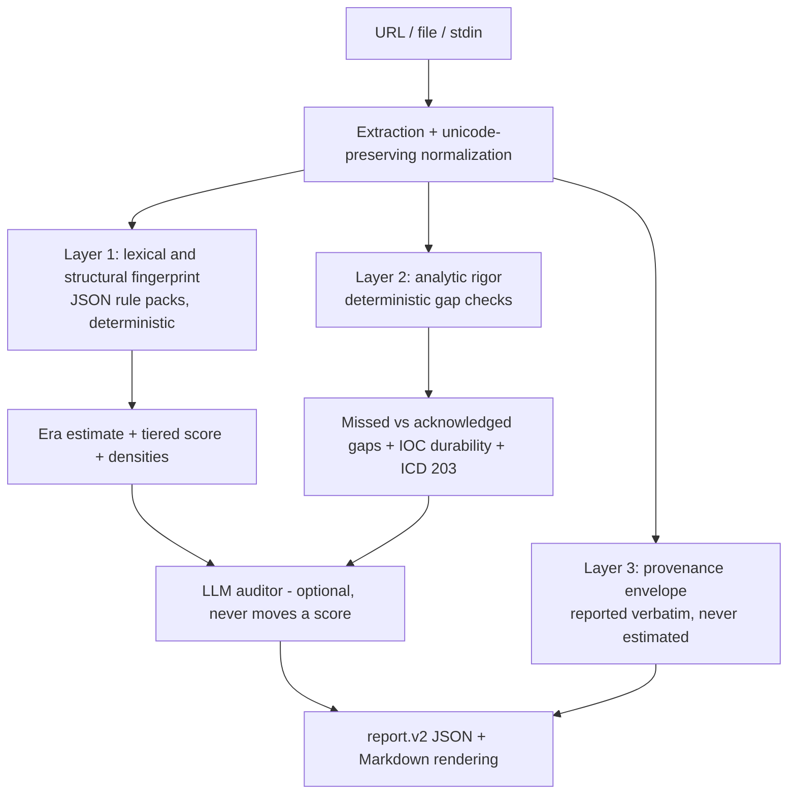

# stopslop

Analytic-rigor scorer for threat intelligence writing.

It answers two questions:

1. Does this text carry the statistical fingerprint of LLM generation, and which model era does that fingerprint match?
2. Does the analysis hold up: what's claimed, what's evidenced, and what's missing?

The first question is a supporting signal. The second is the product. Wikipedia's [Signs of AI writing](https://en.wikipedia.org/wiki/Wikipedia:Signs_of_AI_writing) (WikiProject AI Cleanup) is explicit that the signs are not the problem, they point at the problem, and that treating the signs as the thing to fix just makes detection harder. That's encoded here as a design constraint: no layer emits a verdict, there is no slop boolean, and the guide's ineffective indicators are structurally impossible to score (the rule loader rejects them and a guardrail test enforces it).

## Install

```bash
python3 -m venv .venv
source .venv/bin/activate
pip install -e ".[dev]"        # add ,llm for provider SDKs: pip install -e ".[dev,llm]"
cp .env.example .env           # optional, only needed for the LLM auditor
```

Or run `bash installer.sh`.

## Run

```bash
stopslop --file report.md --no-llm --format md
stopslop --url https://example.com/writeup --out report.json
stopslop --stdin --provenance envelope.json < draft.md
```

## Architecture

Three layers. Each produces findings with character offsets. None produces a verdict.


```mermaid
flowchart TD
A[URL / file / stdin] --> B[Extraction + unicode-preserving normalization]
B --> C[Layer 1: lexical and structural fingerprint\nJSON rule packs, deterministic]
B --> D[Layer 2: analytic rigor\ndeterministic gap checks]
C --> E[Era estimate + tiered score + densities]
D --> F[Missed vs acknowledged gaps + IOC durability + ICD 203]
E --> G[LLM auditor - optional, never moves a score]
F --> G
G --> H[report.v2 JSON + Markdown rendering]
B --> I[Layer 3: provenance envelope\nreported verbatim, never estimated]
I --> H
```

### Layer 1: fingerprint

Deterministic: no network, no API key, no LLM. Same input, same output, forever. Rules live in `rules/*.json`, validated against `schemas/rule.schema.json`; each rule carries a `source_citation` into the specific section of the Wikipedia guide it derives from, plus its own positive and negative example that the test suite executes.

Scoring is tiered, density-normalized, and uncapped:

- **Tier 1, mechanical artifacts** (tool markup like `oai_citation`, `turn0search0`, `[cite: N]`, lenticular brackets, `<think>`, `<thinking>`, `<tool_call>`, `utm_source=chatgpt.com`, thinking-UI chrome like "Thought for 14 seconds", transcript labels like "ChatGPT said:"; placeholder leakage; chat correspondence and sycophancy). Near-conclusive alone, counted absolutely.
- **Tier 2, structural and register** (negative parallelism, copulative avoidance, rule-of-three density, formatting habits, and the 2025-2026 conversational register below). Needs clustering before it counts.
- **Tier 3, lexical** (era-bucketed vocabulary). Needs both density and co-occurrence; one hit never scores.
- **Negative evidence** (signs of human writing: plain copulas, plain verbs, superlatives, hedging, wordy constructions) subtracts, and can never explain away tier 1.

Output is a model-era estimate with confidence bands, a per-category density table, and offset-bearing findings. Humans detect AI text at roughly chance, heavy LLM users hit about 90%, and detector tools have non-trivial error rates; confidence reporting reflects that, and absence of signal is never reported as evidence of human authorship.

#### The 2025-2026 conversational register

The original rule packs fingerprint the 2023-2024 register: `delve`, `tapestry`, `stands as a testament`, `In today's ever-evolving threat landscape`. Current chat models mostly stopped writing that way. They write like a confident blogger instead, and `rules/layer1_narrative.json` scores that register as a fingerprint in its own right:

| Category | What it catches |
|---|---|
| `performed-candor` | "One thing I won't hide", "I'll be honest", "let me be direct", "the honest answer is", "worth stating plainly", a bare "Honestly?" |
| `payoff-hooks` | "here's the thing", "here's the kicker", "the best part?", "here's where it gets interesting", "let that sink in", "full stop" |
| `rhetorical-qa` | "The catch? It only runs on Linux.", "Why does this matter? Because...", "Does this work? Absolutely." |
| `colon-fragments` | "Translation:", "Bottom line:", "The result:", "TL;DR:", "Better posed:" |
| `sycophancy` | "You're absolutely right", "Great question", "You're not imagining it" (tier 1: it is a reply to someone who is not the reader) |
| `chat-offers` | "Want me to...?", "If you'd like, I can", "Just say the word" (tier 1) |
| `reasoning-leakage` | "Wait, actually", "let me double-check", "on second thought", leaked `**Reasoning:**` labels |
| `hortatives` | "let's dive in", "let's unpack", "picture this", "buckle up" |
| `conversational-register` | "That said,", "Which brings me to", "Crucially,", "Ultimately,", "The reality is" |
| `negative-parallelism` | 2026 variants: "not because X, but because Y", "less about X and more about Y", "This isn't X. This is Y." |
| `staccato` | "No fluff. No filler. Just results.", "Not a detail. A design decision.", dash-appended tails like "— and that's the point" |
| `payoff-hooks` (recentering) | "the real question", "what actually happened", "the part most people miss" |
| `signposting` | "In this post we'll", "More on that below", "As we'll see", "This is where X comes in" |
| `second-person` | "What you're describing is", "If you're reading this", "You might be thinking" |

Two new era buckets go with it. `chat2026` is called from the register categories plus a 2025-2026 word list (`genuinely`, `nuanced`, `deceptively simple`, `heavy lifting`, `quiet confidence`), and needs five hits across two distinct categories before it fires, because one "That said," is a human with a blog voice. `claude` is the per-model bucket the guide's *Differences between LLMs* section calls for, anchored on `load-bearing`, the strongest quantified tell in the literature: 929 occurrences inside the Claude-authored cluster of a 461k-pull-request corpus against 82 outside it.

Domain collisions are excluded on purpose. `beacon`, `surface` as a verb, `realm`, `unlock`, `harness`, and `elevate` are ordinary SOC vocabulary and never score; structured analyst labels (`Hypothesis:`, `Method:`, `Scope:`, `Recommendation:`) are excluded from the colon-fragment rule; "in the interest of full disclosure" is excluded from performed candor, because in security writing it introduces a real conflict-of-interest statement. `tests/test_narrative_register.py` carries ten probes of ordinary analyst prose that must score exactly zero, and they are the real specification for this pack.

Register is a weaker signal than markup, and it is the easiest thing in the tool to edit around: every phrase here is publicly catalogued, so one editing pass strips them. That is the guide's own warning, and it is why these rules are tier 2 and 3, gated by clustering, and why layer 2 stays the product.

### Layer 2: analytic rigor

Deterministic gap detection over the claims-vs-evidence structure of a CTI writeup:

- attribution claims vs stated basis (infrastructure overlap, code reuse, tradecraft, victimology)
- variant-name continuity claims ("Mini X" implies an operator link the text may not carry)
- **containment metrics masquerading as blast radius**: "61,274 tokens revoked" measures the responder's action, not the campaign's reach; every quantity near a responder verb plus impact framing gets flagged
- capability described vs impact demonstrated
- victim quantification, motive, exposure window, sample provenance, detection validation (including self-referential validation against the report's own IOCs)
- indicator durability tiering: behaviors survive the next variant, values don't
- ICD 203 confidence-language coherence

Every check distinguishes a gap the text **missed** from a gap the text **acknowledged**. A report that says "no exposure window is published" did its job.

The optional LLM auditor writes the critical review and proposed research artifacts grounded in the deterministic findings. It never sets or moves a score. Model versions are pinned in `core/config.py` and echoed into the report; if no provider is reachable, the deterministic output stands alone and says so.

### Layer 3: provenance

A front end can emit a provenance envelope; the CLI accepts it with `--provenance`:

```json
{
  "typed_chars": 19,
  "pasted_chars": 4743,
  "paste_events": 4,
  "elapsed_seconds": 2238,
  "word_budget": 100
}
```

Present: the report carries the meter line (`typed 19 · pasted 4743 (4 pastes) · 2238s · 95/100 words`) and the paste ratio. Absent: the report says so. This data can't be recovered from a finished document, so it is never estimated. The word budget is a hard cap on generated sections.

## Output contract

`schemas/report.v2.json`, with a Markdown renderer over it. Deterministic findings and LLM prose stay in separate fields. No global threshold, no slop boolean. The renderer's own prose obeys the tool's voice rules (no em dashes, no emoji, hyphens only) and CI dogfoods the linter against its own output.

## Configuration

Environment variables (see `.env.example`): `ANTHROPIC_API_KEY` / `OPENAI_API_KEY` / `GOOGLE_API_KEY` for the auditor, `ANTHROPIC_MODEL` / `OPENAI_MODEL` / `GEMINI_MODEL` to override the pinned versions, `STOPSLOP_MAX_CHARS`, `STOPSLOP_TIMEOUT_SEC`, `STOPSLOP_BLOCK_PRIVATE_IPS`.

## Threat model

URL fetching keeps the SSRF guard and re-checks every redirect hop before following it. Timeouts everywhere, JSON-only model outputs, no code execution. Known limit: DNS rebinding between check and request is out of scope.

## Rule drift

Rules decay. The guide they cite is edited close to daily, and the models they fingerprint ship new habits every few months. `scripts/watch_sources.py` is the patrol:

```bash
python scripts/watch_sources.py              # exit 0 clean, 1 drift, 2 could not check
python scripts/watch_sources.py --update-pin # re-pin after reviewing
```

It derives what to watch from the rule set itself. Every rule's `source_citation` names a guide section, so the sections the packs depend on are computed from `rules/*.json` rather than maintained by hand, and three things get reported:

- **STALE** a rule cites a section that no longer exists under that name, with the closest live section as a suggestion
- **UNCOVERED** the guide has a scoreable section no rule cites. Subsections inherit coverage from a cited parent, and Wikipedia-editing sections (broken wikitext, AfC drafts, canned user pages) are listed as out of scope in the script, so an entry here is a decision rather than an oversight
- **DRIFT** a cited section's wikitext changed since the pinned revision in `.rule-sources.json`

Watching the page as a whole would produce a false alarm every day and get muted inside a week, so only cited sections are diffed, each hashed across its own subsections, against a revision a human re-pins after review. One API call for the section list, one for the wikitext; no LLM and no judgement anywhere in it.

`.github/workflows/rule-drift.yml` runs it weekly and keeps a single `rule-drift` issue updated in place, closing it when the tree comes back clean. `tests/test_source_pin.py` is the offline half: it fails if a rule cites a section the pin doesn't cover, which is the realistic mistake.

The first run found 13 stale citations. The guide had renamed *Vague attributions of opinion* to *Vague attributions and overgeneralization of opinions*, *Horizontal rules* to *Thematic breaks between sections*, *Section headings* to *Skipping heading levels*, *Emoji* to *Emoji as formatting*, folded the four *Words overused by AI* buckets into *High density of "AI vocabulary" words*, and absorbed *turn0search0* into *Internal formatting and reference markup bugs*. Those are fixed; the patrol exists so the next round gets caught in a week instead of a year.

## Development

```bash
pytest                 # full suite, including golden fixtures and the dogfood lint
ruff check core tests
mypy                   # --strict over core/, configured in pyproject.toml
```

The golden pair lives in `tests/fixtures/`: `mini-shai-hulud/` (a gap-laden writeup the tool must pick apart) and `well-sourced/` (the same incident with every gap closed, which must come back clean). If the tool can't tell them apart, it doesn't work, and CI checks exactly that.

`tests/fixtures/corpus/` holds the layer-1 corpus: `fixture-slop.md` (2023-2024 slop, annotated in `fixture-annotations.md`), `fixture-clean.md` (the human control), and `fixture-narrative.md` (the same incident in 2025-2026 chat register, annotated in `fixture-narrative-annotations.md`). The narrative fixture reads as era `none`, net 0.0 against the v2.0 rule set and `chat2026`, confidence high against 2.1: that delta is the miss this pack closes. The CI gate asserts both directions, including that the human control still scores exactly 0.0 once the register rules ship.

## License

Apache 2.0
